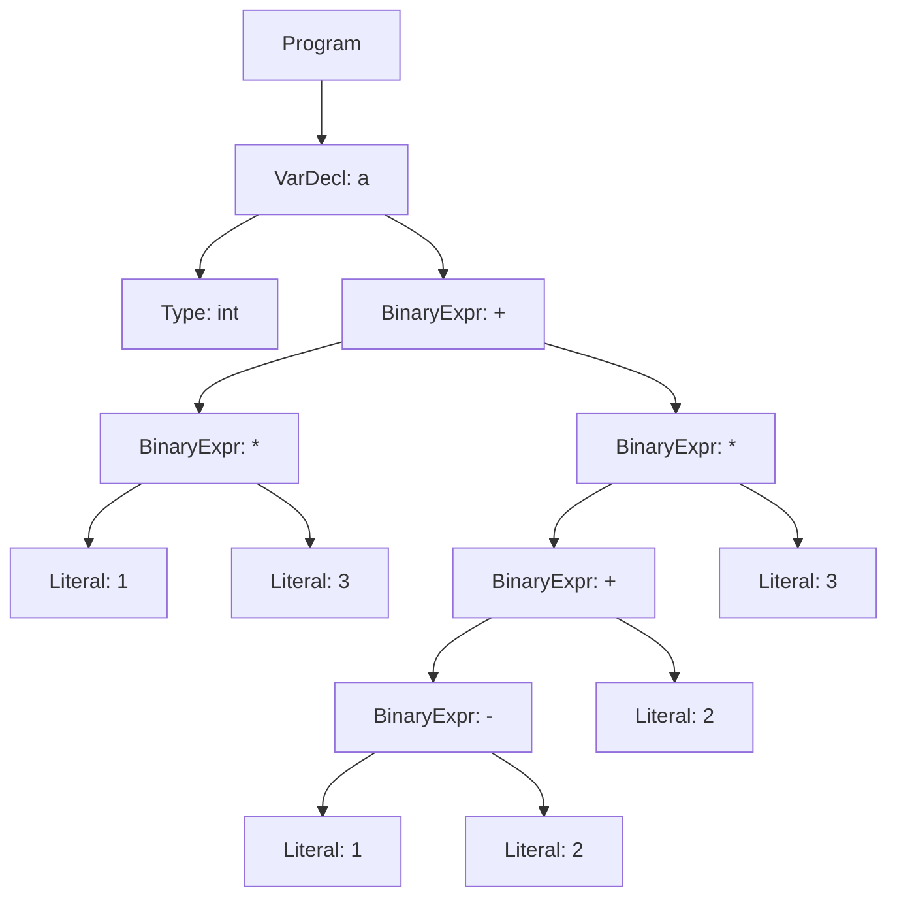

```mermaid
graph TD
node0[Program]
node1[VarDecl: a]
node0 --> node1
node2[Type: int]
node1 --> node2
node3[BinaryExpr: +]
node1 --> node3
node4[BinaryExpr: *]
node3 --> node4
node5[Literal: 1]
node4 --> node5
node6[Literal: 3]
node4 --> node6
node7[BinaryExpr: *]
node3 --> node7
node8[BinaryExpr: +]
node7 --> node8
node9[BinaryExpr: -]
node8 --> node9
node10[Literal: 1]
node9 --> node10
node11[Literal: 2]
node9 --> node11
node12[Literal: 2]
node8 --> node12
node13[Literal: 3]
node7 --> node13
```